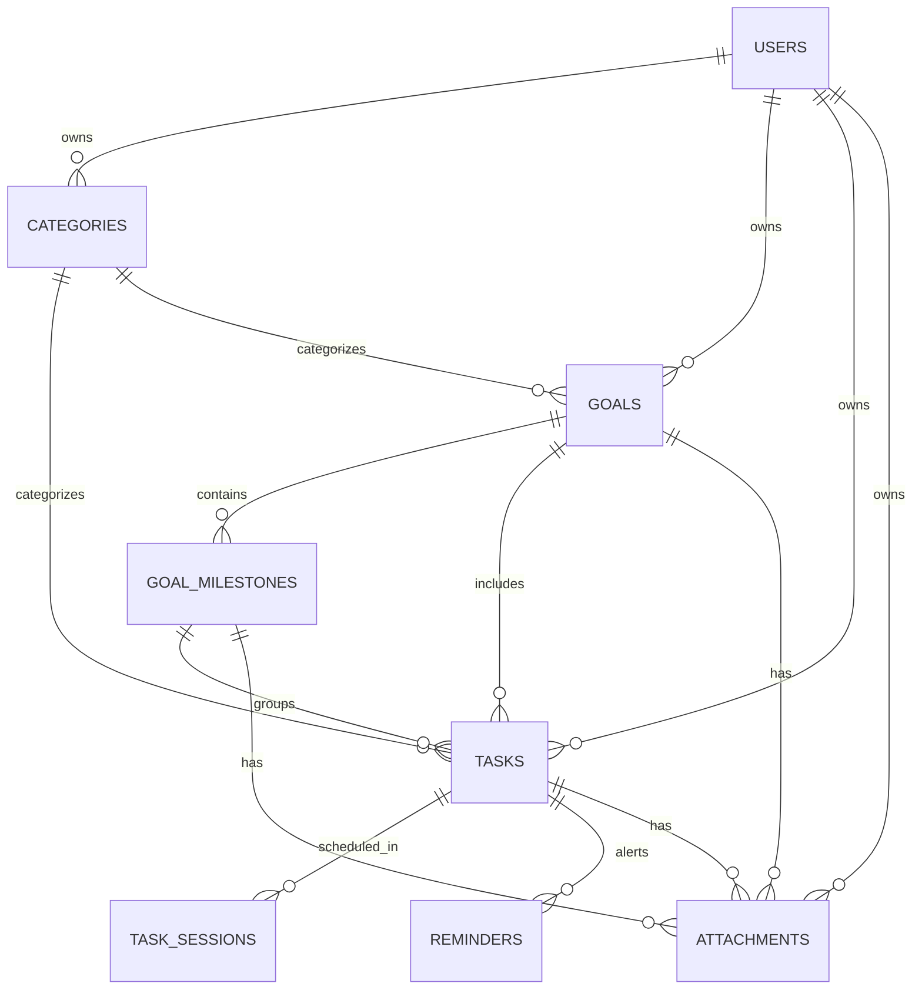

# Priora System Architecture Specification — v1.0.0 Freeze

> **Release Tag**: `v1.0.0`  
> **Status**: Frozen Core Architecture  
> **Date**: August 20, 2026  

---

## 📑 Executive Summary

Priora is a multi-tier, time-blocking productivity & goal management platform built with a **FastAPI (Python)** backend and a **Flutter (Dart)** frontend.

This document defines the frozen architectural state of Priora at version `v1.0.0`. It documents all database models, entity relationships, backend API modules, and Flutter presentation/domain feature structures.

---

## 1. 🗄️ Database Models & Schemas (SQLAlchemy)

All database entities extend `BaseDBModel`, inheriting common fields:
- `id` (`UUIDv4`, Primary Key, indexed)
- `created_at` (`DateTime(timezone=True)`, default `utc_now`)
- `updated_at` (`DateTime(timezone=True)`, onupdate `utc_now`)
- `deleted_at` (`DateTime(timezone=True)`, nullable for soft deletion)

### 1.1 `users` Table
Stores user accounts, authentication credentials, and storage usage metrics.

| Column | Type | Constraints | Description |
|---|---|---|---|
| `id` | `UUID` | PK | Unique User Identifier |
| `email` | `VARCHAR(255)` | Unique, Indexed, NOT NULL | Account email address |
| `hashed_password` | `VARCHAR(255)` | NULLable | Argon2 / Passlib password hash (NULL for OAuth) |
| `full_name` | `VARCHAR(255)` | NULLable | User display name |
| `avatar_url` | `VARCHAR(512)` | NULLable | Avatar image URL |
| `auth_provider` | `VARCHAR(20)` | Default `'email'`, NOT NULL | Auth method (`email`, `google`) |
| `is_email_verified` | `BOOLEAN` | Default `False`, NOT NULL | Email verification flag |
| `is_active` | `BOOLEAN` | Default `True`, NOT NULL | Active status toggle |
| `storage_used_bytes` | `BIGINT` | Default `0`, NOT NULL | Total attachment storage consumed in bytes |
| `created_at` | `TIMESTAMPTZ` | Default `now()`, NOT NULL | Timestamp created |
| `updated_at` | `TIMESTAMPTZ` | Default `now()`, NOT NULL | Timestamp updated |
| `deleted_at` | `TIMESTAMPTZ` | NULLable | Soft delete timestamp |

---

### 1.2 `categories` Table
User-defined task and goal category tags.

| Column | Type | Constraints | Description |
|---|---|---|---|
| `id` | `UUID` | PK | Unique Category Identifier |
| `user_id` | `UUID` | FK (`users.id` CASCADE), Indexed, NOT NULL | Category owner |
| `name` | `VARCHAR(100)` | NOT NULL | Category display name (e.g. Work, Personal) |
| `color` | `VARCHAR(20)` | Default `'#2D6A4F'`, NOT NULL | Hex color badge |
| `icon` | `VARCHAR(50)` | NULLable | Material icon string identifier |

---

### 1.3 `goals` Table
High-level long-term targets and roadmaps.

| Column | Type | Constraints | Description |
|---|---|---|---|
| `id` | `UUID` | PK | Unique Goal Identifier |
| `user_id` | `UUID` | FK (`users.id` CASCADE), Indexed, NOT NULL | Goal owner |
| `category_id` | `UUID` | FK (`categories.id` SET NULL), Indexed, NULLable | Linked category |
| `title` | `VARCHAR(255)` | NOT NULL | Goal title |
| `description` | `TEXT` | NULLable | Detailed goal description |
| `target_date` | `DATE` | NULLable | Target completion date |
| `status` | `VARCHAR(50)` | Default `'IN_PROGRESS'`, Indexed, NOT NULL | Status (`IN_PROGRESS`, `COMPLETED`, `CANCELLED`) |
| `color` | `VARCHAR(50)` | Default `'#6366F1'`, NULLable | Custom card color accent |
| `icon` | `VARCHAR(50)` | Default `'flag_rounded'`, NULLable | Icon identifier |
| `attachment_count` | `INTEGER` | Default `0`, NOT NULL | Cached count of attached resources |

---

### 1.4 `goal_milestones` Table
Intermediate checkpoints/phases belonging to a Goal.

| Column | Type | Constraints | Description |
|---|---|---|---|
| `id` | `UUID` | PK | Unique Milestone Identifier |
| `goal_id` | `UUID` | FK (`goals.id` CASCADE), Indexed, NOT NULL | Parent goal |
| `title` | `VARCHAR(255)` | NOT NULL | Milestone checkpoint title |
| `description` | `TEXT` | NULLable | Phase details |
| `target_date` | `DATE` | NULLable | Phase deadline date |
| `is_completed` | `BOOLEAN` | Default `False`, NOT NULL | Completion state |
| `order_index` | `INTEGER` | Default `0`, NOT NULL | Ordering position within goal |

---

### 1.5 `tasks` Table
Core actionable items linked to categories, goals, and milestones.

| Column | Type | Constraints | Description |
|---|---|---|---|
| `id` | `UUID` | PK | Unique Task Identifier |
| `user_id` | `UUID` | FK (`users.id` CASCADE), Indexed, NOT NULL | Task owner |
| `category_id` | `UUID` | FK (`categories.id` SET NULL), Indexed, NULLable | Linked category |
| `goal_id` | `UUID` | FK (`goals.id` SET NULL), Indexed, NULLable | Linked goal |
| `milestone_id` | `UUID` | FK (`goal_milestones.id` SET NULL), Indexed, NULLable | Linked milestone |
| `title` | `VARCHAR(255)` | NOT NULL | Task title |
| `description` | `TEXT` | NULLable | Rich task details |
| `priority` | `VARCHAR(20)` | Default `'MEDIUM'`, Indexed, NOT NULL | Priority (`LOW`, `MEDIUM`, `HIGH`, `CRITICAL`) |
| `status` | `VARCHAR(20)` | Default `'PENDING'`, Indexed, NOT NULL | Status (`PENDING`, `IN_PROGRESS`, `COMPLETED`, `CANCELLED`) |
| `deadline` | `TIMESTAMPTZ` | Indexed, NULLable | Due date and time |
| `scheduled_start` | `TIMESTAMPTZ` | Indexed, NULLable | Primary scheduled time block start |
| `scheduled_end` | `TIMESTAMPTZ` | Indexed, NULLable | Primary scheduled time block end |
| `estimated_minutes` | `INTEGER` | NULLable | Estimated duration in minutes |
| `attachment_count` | `INTEGER` | Default `0`, NOT NULL | Cached count of attached resources |
| `completed_at` | `TIMESTAMPTZ` | NULLable | Timestamp when completed |

---

### 1.6 `task_sessions` Table
Time-blocking focus sessions supporting multi-session task scheduling (e.g. Mon 10-12, Wed 2-4).

| Column | Type | Constraints | Description |
|---|---|---|---|
| `id` | `UUID` | PK | Unique Session Identifier |
| `task_id` | `UUID` | FK (`tasks.id` CASCADE), Indexed, NOT NULL | Parent task |
| `scheduled_start` | `TIMESTAMPTZ` | Indexed, NOT NULL | Focus block start time |
| `scheduled_end` | `TIMESTAMPTZ` | Indexed, NOT NULL | Focus block end time |

---

### 1.7 `reminders` Table
Scheduled push notification alerts for tasks.

| Column | Type | Constraints | Description |
|---|---|---|---|
| `id` | `UUID` | PK | Unique Reminder Identifier |
| `task_id` | `UUID` | FK (`tasks.id` CASCADE), Indexed, NOT NULL | Target task |
| `notification_id` | `INTEGER` | Indexed, NULLable | Local notification ID offset |
| `remind_at` | `TIMESTAMPTZ` | Indexed, NOT NULL | Scheduled alert time |
| `status` | `VARCHAR(20)` | Default `'SCHEDULED'`, Indexed, NOT NULL | Status (`SCHEDULED`, `SENT`, `CANCELLED`) |

---

### 1.8 `attachments` Table
Multi-entity resource attachments (Images, Documents, Web Links, Markdown Notes).

| Column | Type | Constraints | Description |
|---|---|---|---|
| `id` | `UUID` | PK | Unique Attachment Identifier |
| `user_id` | `UUID` | FK (`users.id` CASCADE), Indexed, NOT NULL | Resource owner |
| `task_id` | `UUID` | FK (`tasks.id` CASCADE), Indexed, NULLable | Attached task |
| `goal_id` | `UUID` | FK (`goals.id` CASCADE), Indexed, NULLable | Attached goal |
| `milestone_id` | `UUID` | FK (`goal_milestones.id` CASCADE), Indexed, NULLable | Attached milestone |
| `type` | `VARCHAR(20)` | NOT NULL | Resource type (`IMAGE`, `DOCUMENT`, `LINK`, `NOTE`) |
| `source_type` | `VARCHAR(20)` | Default `'UPLOAD'`, NOT NULL | Creation source (`UPLOAD`, `LINK`, `NOTE`) |
| `name` | `VARCHAR(255)` | NOT NULL | Resource display name |
| `original_filename` | `VARCHAR(255)` | NULLable | Original upload filename |
| `file_path` | `VARCHAR(500)` | NULLable | Local disk relative path |
| `thumbnail_path` | `VARCHAR(500)` | NULLable | Generated thumbnail path |
| `url` | `VARCHAR(1000)` | NULLable | External link URL |
| `thumbnail_url` | `VARCHAR(1000)` | NULLable | External OG image thumbnail URL |
| `domain` | `VARCHAR(150)` | NULLable | Link host domain |
| `site_name` | `VARCHAR(100)` | NULLable | OpenGraph site name |
| `favicon_url` | `VARCHAR(500)` | NULLable | Link favicon URL |
| `content` | `TEXT` | NULLable | Note markdown content |
| `tags` | `VARCHAR(500)` | NULLable | Comma-separated tag keywords |
| `file_hash` | `VARCHAR(64)` | Indexed, NULLable | SHA256 checksum |
| `mime_type` | `VARCHAR(100)` | NULLable | File MIME type |
| `file_size_bytes` | `BIGINT` | NULLable | File byte size |
| `is_pinned` | `BOOLEAN` | Default `False`, NOT NULL | Pin highlight status |
| `search_text` | `TEXT` | NULLable | Combined search index text |

*Compound Index*: `ix_attachments_user_entity` (`user_id`, `task_id`, `goal_id`, `milestone_id`)

---

## 2. 🔗 Entity Relationships & ERD



### Cascading & Foreign Key Rules
1. **User Deletion (`users.id` CASCADE)**: Deleting a User automatically cascades and deletes all associated Categories, Goals, Tasks, and Attachments.
2. **Goal Deletion (`goals.id` CASCADE)**: Deleting a Goal deletes all child GoalMilestones and Attachments. Linked Tasks set `goal_id = NULL` via `SET NULL`.
3. **Task Deletion (`tasks.id` CASCADE)**: Deleting a Task deletes all child TaskSessions, Reminders, and Task Attachments.
4. **Category Deletion (`categories.id` SET NULL)**: Deleting a Category clears `category_id` to `NULL` across all linked Tasks and Goals without deleting them.

---

## 3. ⚡ Backend API Modules (FastAPI)

API Endpoints are versioned under `/api/v1/`:

```
backend/app/api/v1/
├── api.py                    # Root API Router assembly
└── endpoints/
    ├── health.py             # GET /api/v1/health, GET /healthz
    ├── auth.py               # POST /register, POST /login, POST /refresh, POST /logout, GET /me
    ├── users.py              # GET /profile, PUT /profile
    ├── categories.py         # GET /categories, POST /categories, PUT /categories/{id}, DELETE /categories/{id}
    ├── tasks.py              # GET /tasks, POST /tasks, PUT /tasks/{id}, DELETE /tasks/{id}, PATCH /tasks/{id}/complete
    ├── goals.py              # GET /goals, POST /goals, PUT /goals/{id}, DELETE /goals/{id}, POST /goals/{id}/milestones
    ├── planner.py            # GET /planner/timeline, POST /planner/timeblock, DELETE /planner/timeblock/{id}
    ├── review.py             # GET /review/summary, POST /review/complete
    ├── analytics.py          # GET /analytics/overview, GET /analytics/weekly, GET /analytics/heatmap
    ├── reminders.py          # GET /reminders, POST /reminders, DELETE /reminders/{id}
    └── attachments.py        # GET /attachments, POST /attachments/upload, POST /attachments/link, POST /attachments/note
```

---

## 4. 📱 Flutter Feature Architecture (Clean Architecture + Riverpod)

The Flutter codebase strictly enforces Clean Architecture principles:

```
frontend/lib/
├── core/
│   ├── network/             # ApiClient, Dio interceptors, Auth 401 refresh handler
│   ├── storage/             # FlutterSecureStorage wrapper
│   └── theme/               # AppTheme, AppColors, ThemeController, AppAccentColor
├── shared/
│   └── widgets/             # AppEmptyView, AppErrorView, MainScaffold, AppCard
├── routes/
│   └── app_router.dart      # GoRouter configuration, protected ShellRoute, auth guard
└── features/
    ├── auth/                # LoginScreen, RegisterScreen, AuthController, AuthStorage
    ├── tasks/               # TasksScreen, CreateTaskBottomSheet, EditTaskBottomSheet, TasksController
    ├── goals/               # GoalsScreen, GoalDetailScreen, CreateGoalBottomSheet, GoalsController
    ├── planner/             # PlannerScreen, TimeBlockSelectorDialog, PlannerController
    ├── review/              # EveningReviewScreen, ReviewCelebrationDialog, ReviewController
    ├── analytics/           # AnalyticsScreen, TaskHeatmapWidget, AnalyticsController
    ├── attachments/         # AttachmentGrid, ResourceSectionWidget, AddAttachmentModal, AttachmentsController
    ├── reminders/           # ReminderPresetPicker, RemindersController
    ├── dashboard/           # TodayDashboardScreen, QuickActionFloatingMenu
    └── settings/            # SettingsScreen, ThemeModeTile, AccentPalettePicker, ReduceMotionSwitch
```

---

## 5. 🔒 Architectural Discipline Rules

1. **No Direct State Mutation**: Domain models are strictly immutable (`copyWith` pattern). All state mutations occur within Riverpod `StateNotifier` controllers.
2. **Standardized Feedback**: Screens must use `AppEmptyView` for zero-state feedback and `AppErrorView` for failures.
3. **Resilient Network Client**: All API requests pass through `ApiClient`. 401 Unauthorized responses trigger automatic token refresh before retrying pending requests.
