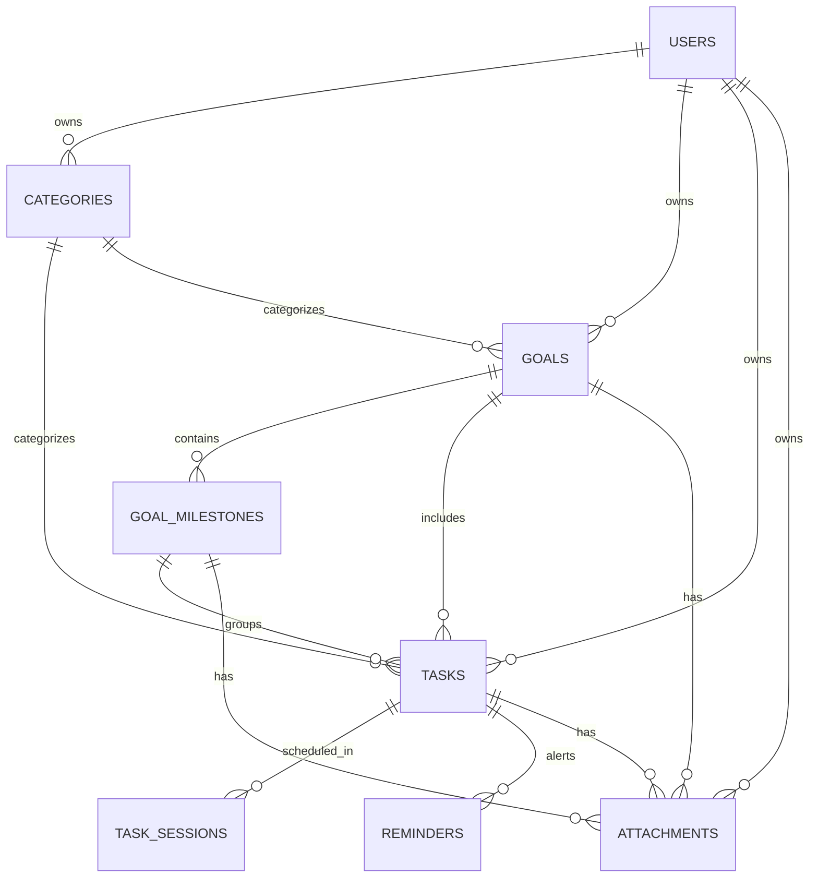

# Priora System Architecture Specification — v1.0.0 Freeze

> **Release Tag**: `v1.0.0`  
> **Status**: Frozen Core Architecture  
> **Date**: August 20, 2026  

---

## 📑 Executive Summary

Priora is a multi-tier, time-blocking productivity & goal management platform built with a **FastAPI (Python)** backend and a **Flutter (Dart)** frontend.

This document defines the frozen architectural reference state of Priora at version `v1.0.0`. It documents database models, schema freeze snapshots, entity relationships, API contract inventories, state management provider flows, performance optimizations, and known technical debt.

---

## 1. 🗄️ Versioned Database Schema Freeze (SQLAlchemy)

All database entities inherit from `BaseDBModel`, containing mandatory metadata columns:
- `id` (`UUIDv4`, Primary Key, indexed)
- `created_at` (`TIMESTAMPTZ`, default `utc_now()`, NOT NULL)
- `updated_at` (`TIMESTAMPTZ`, default `utc_now()`, onupdate `utc_now()`, NOT NULL)
- `deleted_at` (`TIMESTAMPTZ`, NULLable, soft-delete timestamp)

---

### 1.1 `users` Table Freeze
Stores user credentials, profile metadata, and storage metrics.

| Column | Type | Nullable | Default / Constraints | Description |
|---|---|---|---|---|
| `id` | `UUID` | No | Primary Key | Unique User Identifier |
| `email` | `VARCHAR(255)` | No | Unique, Index | User email address |
| `hashed_password` | `VARCHAR(255)` | Yes | NULL | Argon2 password hash (NULL for OAuth) |
| `full_name` | `VARCHAR(255)` | Yes | NULL | Display name |
| `avatar_url` | `VARCHAR(512)` | Yes | NULL | Profile image URL |
| `auth_provider` | `VARCHAR(20)` | No | `'email'` | Provider (`email`, `google`) |
| `is_email_verified` | `BOOLEAN` | No | `False` | Email verification flag |
| `is_active` | `BOOLEAN` | No | `True` | Active status toggle |
| `storage_used_bytes` | `BIGINT` | No | `0` | Attachment disk space consumed in bytes |
| `created_at` | `TIMESTAMPTZ` | No | `now()` | Creation timestamp |
| `updated_at` | `TIMESTAMPTZ` | No | `now()` | Update timestamp |
| `deleted_at` | `TIMESTAMPTZ` | Yes | NULL | Soft delete timestamp |

---

### 1.2 `categories` Table Freeze
User-defined organizational category tags.

| Column | Type | Nullable | Default / Constraints | Description |
|---|---|---|---|---|
| `id` | `UUID` | No | Primary Key | Category Identifier |
| `user_id` | `UUID` | No | FK (`users.id` CASCADE), Index | Category owner |
| `name` | `VARCHAR(100)` | No | — | Category name (e.g., Work, Study) |
| `color` | `VARCHAR(20)` | No | `'#2D6A4F'` | Hex color badge |
| `icon` | `VARCHAR(50)` | Yes | NULL | Material icon string identifier |

---

### 1.3 `goals` Table Freeze
Long-term objective roadmaps.

| Column | Type | Nullable | Default / Constraints | Description |
|---|---|---|---|---|
| `id` | `UUID` | No | Primary Key | Goal Identifier |
| `user_id` | `UUID` | No | FK (`users.id` CASCADE), Index | Goal owner |
| `category_id` | `UUID` | Yes | FK (`categories.id` SET NULL), Index | Linked category |
| `title` | `VARCHAR(255)` | No | — | Goal title |
| `description` | `TEXT` | Yes | NULL | Detailed roadmap details |
| `target_date` | `DATE` | Yes | NULL | Target completion date |
| `status` | `VARCHAR(50)` | No | `'IN_PROGRESS'`, Index | Status (`IN_PROGRESS`, `COMPLETED`, `CANCELLED`) |
| `color` | `VARCHAR(50)` | Yes | `'#6366F1'` | Card color accent |
| `icon` | `VARCHAR(50)` | Yes | `'flag_rounded'` | Card icon identifier |
| `attachment_count` | `INTEGER` | No | `0` | Cached count of attached resources |

---

### 1.4 `goal_milestones` Table Freeze
Intermediate checkpoints belonging to a Goal.

| Column | Type | Nullable | Default / Constraints | Description |
|---|---|---|---|---|
| `id` | `UUID` | No | Primary Key | Milestone Identifier |
| `goal_id` | `UUID` | No | FK (`goals.id` CASCADE), Index | Parent Goal |
| `title` | `VARCHAR(255)` | No | — | Checkpoint title |
| `description` | `TEXT` | Yes | NULL | Checkpoint phase details |
| `target_date` | `DATE` | Yes | NULL | Target date |
| `is_completed` | `BOOLEAN` | No | `False` | Completion status |
| `order_index` | `INTEGER` | No | `0` | Sort order index within goal |

---

### 1.5 `tasks` Table Freeze
Core actionable items linked to categories, goals, and milestones.

| Column | Type | Nullable | Default / Constraints | Description |
|---|---|---|---|---|
| `id` | `UUID` | No | Primary Key | Task Identifier |
| `user_id` | `UUID` | No | FK (`users.id` CASCADE), Index | Task owner |
| `category_id` | `UUID` | Yes | FK (`categories.id` SET NULL), Index | Category tag |
| `goal_id` | `UUID` | Yes | FK (`goals.id` SET NULL), Index | Linked Goal |
| `milestone_id` | `UUID` | Yes | FK (`goal_milestones.id` SET NULL), Index | Linked Milestone |
| `title` | `VARCHAR(255)` | No | — | Task title |
| `description` | `TEXT` | Yes | NULL | Task description |
| `priority` | `VARCHAR(20)` | No | `'MEDIUM'`, Index | Priority (`LOW`, `MEDIUM`, `HIGH`, `CRITICAL`) |
| `status` | `VARCHAR(20)` | No | `'PENDING'`, Index | Status (`PENDING`, `IN_PROGRESS`, `COMPLETED`, `CANCELLED`) |
| `deadline` | `TIMESTAMPTZ` | Yes | Index | Due timestamp |
| `scheduled_start` | `TIMESTAMPTZ` | Yes | Index | Primary focus start time |
| `scheduled_end` | `TIMESTAMPTZ` | Yes | Index | Primary focus end time |
| `estimated_minutes` | `INTEGER` | Yes | NULL | Duration estimate in minutes |
| `attachment_count` | `INTEGER` | No | `0` | Cached count of attached resources |
| `completed_at` | `TIMESTAMPTZ` | Yes | NULL | Completion timestamp |

---

### 1.6 `task_sessions` Table Freeze
Multi-session time-blocking focus periods for tasks.

| Column | Type | Nullable | Default / Constraints | Description |
|---|---|---|---|---|
| `id` | `UUID` | No | Primary Key | Session Identifier |
| `task_id` | `UUID` | No | FK (`tasks.id` CASCADE), Index | Parent Task |
| `scheduled_start` | `TIMESTAMPTZ` | No | Index | Timeblock start time |
| `scheduled_end` | `TIMESTAMPTZ` | No | Index | Timeblock end time |

---

### 1.7 `reminders` Table Freeze
Scheduled push notification alerts for tasks.

| Column | Type | Nullable | Default / Constraints | Description |
|---|---|---|---|---|
| `id` | `UUID` | No | Primary Key | Reminder Identifier |
| `task_id` | `UUID` | No | FK (`tasks.id` CASCADE), Index | Target Task |
| `notification_id` | `INTEGER` | Yes | Index | Local notification ID offset |
| `remind_at` | `TIMESTAMPTZ` | No | Index | Alert dispatch timestamp |
| `status` | `VARCHAR(20)` | No | `'SCHEDULED'`, Index | Status (`SCHEDULED`, `SENT`, `CANCELLED`) |

---

### 1.8 `attachments` Table Freeze
Multi-entity resources attached to Tasks, Goals, or Milestones.

| Column | Type | Nullable | Default / Constraints | Description |
|---|---|---|---|---|
| `id` | `UUID` | No | Primary Key | Attachment Identifier |
| `user_id` | `UUID` | No | FK (`users.id` CASCADE), Index | Owner |
| `task_id` | `UUID` | Yes | FK (`tasks.id` CASCADE), Index | Linked Task |
| `goal_id` | `UUID` | Yes | FK (`goals.id` CASCADE), Index | Linked Goal |
| `milestone_id` | `UUID` | Yes | FK (`goal_milestones.id` CASCADE), Index | Linked Milestone |
| `type` | `VARCHAR(20)` | No | — | Type (`IMAGE`, `DOCUMENT`, `LINK`, `NOTE`) |
| `source_type` | `VARCHAR(20)` | No | `'UPLOAD'` | Source (`UPLOAD`, `LINK`, `NOTE`) |
| `name` | `VARCHAR(255)` | No | — | Resource display name |
| `original_filename` | `VARCHAR(255)` | Yes | NULL | Original upload filename |
| `file_path` | `VARCHAR(500)` | Yes | NULL | Storage relative path |
| `thumbnail_path` | `VARCHAR(500)` | Yes | NULL | Thumbnail relative path |
| `url` | `VARCHAR(1000)` | Yes | NULL | Web link URL |
| `thumbnail_url` | `VARCHAR(1000)` | Yes | NULL | Web link preview image |
| `domain` | `VARCHAR(150)` | Yes | NULL | Host domain |
| `site_name` | `VARCHAR(100)` | Yes | NULL | OpenGraph site name |
| `favicon_url` | `VARCHAR(500)` | Yes | NULL | Favicon URL |
| `content` | `TEXT` | Yes | NULL | Markdown note body |
| `tags` | `VARCHAR(500)` | Yes | NULL | Tag keywords |
| `file_hash` | `VARCHAR(64)` | Yes | Index | SHA256 file checksum |
| `mime_type` | `VARCHAR(100)` | Yes | NULL | File MIME type |
| `file_size_bytes` | `BIGINT` | Yes | NULL | File size in bytes |
| `is_pinned` | `BOOLEAN` | No | `False` | Pin highlight toggle |
| `search_text` | `TEXT` | Yes | NULL | Fulltext search index text |

*Compound Index*: `ix_attachments_user_entity` (`user_id`, `task_id`, `goal_id`, `milestone_id`)

---

## 2. 🔗 Entity Relationships & ERD



---

## 3. 📑 API Contract Inventory

### 3.1 Authentication & Users
- **`POST /api/v1/auth/register`** (Auth: None)
  - *Request*: `{"email": "string", "password": "string", "full_name": "string"}`
  - *Response*: `{"id": "UUID", "email": "string", "full_name": "string", "created_at": "TIMESTAMPTZ"}`
- **`POST /api/v1/auth/login`** (Auth: OAuth2 Form)
  - *Request*: Form `username`, `password`
  - *Response*: `{"access_token": "JWT", "refresh_token": "JWT", "token_type": "bearer"}`
- **`POST /api/v1/auth/refresh`** (Auth: None)
  - *Request*: `{"refresh_token": "JWT"}`
  - *Response*: `{"access_token": "JWT", "refresh_token": "JWT", "token_type": "bearer"}`
- **`GET /api/v1/auth/me`** (Auth: Bearer JWT)
  - *Response*: `{"id": "UUID", "email": "string", "full_name": "string", "storage_used_bytes": 0}`

### 3.2 Tasks & Categories
- **`GET /api/v1/tasks`** (Auth: Bearer JWT)
  - *Query Params*: `status`, `category_id`, `goal_id`, `priority`
  - *Response*: List of `Task` objects.
- **`POST /api/v1/tasks`** (Auth: Bearer JWT)
  - *Request*: `{"title": "string", "priority": "HIGH", "category_id": "UUID?", "goal_id": "UUID?", "deadline": "TIMESTAMPTZ?"}`
  - *Response*: Complete `Task` object.
- **`PATCH /api/v1/tasks/{id}/complete`** (Auth: Bearer JWT)
  - *Response*: Updated `Task` object with `status: "COMPLETED"`, `completed_at: "TIMESTAMPTZ"`.

### 3.3 Goals & Milestones
- **`GET /api/v1/goals`** (Auth: Bearer JWT)
  - *Response*: List of `Goal` objects with embedded `milestones` array and computed `progress` percentage.
- **`POST /api/v1/goals`** (Auth: Bearer JWT)
  - *Request*: `{"title": "string", "target_date": "YYYY-MM-DD?", "milestones": [{"title": "Phase 1"}]}`
  - *Response*: Created `Goal` object.

### 3.4 Planner & Sessions
- **`GET /api/v1/planner/timeline`** (Auth: Bearer JWT)
  - *Query Params*: `date` (`YYYY-MM-DD`)
  - *Response*: `{"date": "YYYY-MM-DD", "sessions": [...], "conflicts": [...]}`
- **`POST /api/v1/planner/timeblock`** (Auth: Bearer JWT)
  - *Request*: `{"task_id": "UUID", "scheduled_start": "TIMESTAMPTZ", "scheduled_end": "TIMESTAMPTZ"}`
  - *Response*: Created `TaskSession` object.

### 3.5 Review & Analytics
- **`POST /api/v1/review/complete`** (Auth: Bearer JWT)
  - *Request*: `{"reflection_notes": "string", "mood_rating": 5}`
  - *Response*: `{"status": "SUCCESS", "completed_count": 5, "streak": 7}`
- **`GET /api/v1/analytics/overview`** (Auth: Bearer JWT)
  - *Response*: `{"completion_rate": 85.5, "current_streak": 7, "total_focus_minutes": 420, ...}`
- **`GET /api/v1/analytics/heatmap`** (Auth: Bearer JWT)
  - *Query Params*: `tz_offset` (minutes)
  - *Response*: `{"daily_counts": {"2026-08-20": 4, "2026-08-19": 6}}`

### 3.6 Attachments
- **`POST /api/v1/attachments/note`** (Auth: Bearer JWT)
  - *Request*: `{"name": "string", "content": "string", "task_id": "UUID?"}`
  - *Response*: Created `Attachment` object.
- **`POST /api/v1/attachments/upload`** (Auth: Bearer JWT)
  - *Multipart*: `file`, `task_id?`, `goal_id?`
  - *Response*: Created `Attachment` object with `file_path`, `file_size_bytes`, `mime_type`.

---

## 4. 📱 Flutter State Management Architecture

```
[ UI Screen ]
     │  (Ref.watch / UI Events)
     ▼
[ StateNotifier Provider ] (Riverpod Controller)
     │  (Async Operations / State Mutation)
     ▼
[ Data Repository ]
     │  (HTTP / Auth Interceptor)
     ▼
[ ApiClient (Dio) ]
     │  (HTTPS JSON REST API)
     ▼
[ FastAPI Backend ]
```

### Provider Ownership Inventory
- **`authControllerProvider`**: Manages `AuthState` (`authenticated`, `unauthenticated`, `userModel`).
- **`themeControllerProvider`**: Manages `ThemeState` (`mode`, `accent`, `reduceMotion`) persisted via `FlutterSecureStorage`.
- **`tasksControllerProvider`**: Manages `TasksState` (task list, active filters, status metrics, `today` tab).
- **`goalsControllerProvider`**: Manages `GoalsState` (goal roadmap list, sub-milestone toggles, progress).
- **`plannerControllerProvider`**: Manages `PlannerState` (selected date timeline, hourly focus blocks, auto-placement).
- **`reviewControllerProvider`**: Manages `ReviewState` (evening reflection task queue, celebration recap dialog).
- **`analyticsControllerProvider`**: Manages `AnalyticsState` (overview counters, focus duration, timezone-aware heatmap).
- **`attachmentsControllerProvider`**: Manages `AttachmentsState` (multi-entity resource grid, file upload status, storage quota).
- **`remindersControllerProvider`**: Manages `RemindersState` (task scheduled alert list, preset offsets).

---

## 5. 🚀 Performance-Critical Components & Design Rationale

1. **Cached `attachment_count` Counter Column**:
   - *Rationale*: Tasks and Goals frequently display attachment badge counts in list views. Counting attachments via `SELECT COUNT(*)` on every list query introduces severe DB join overhead. Maintaining a cached `attachment_count` on `tasks` and `goals` updated by triggers/repository logic guarantees $O(1)$ read performance.
2. **Dynamic Analytics Aggregation (No Log Tables)**:
   - *Rationale*: Pre-calculated `daily_stats` log tables create data redundancy and sync bugs when tasks are backdated or deleted. Priora computes streak, velocity, and heatmaps on-the-fly using indexed `COMPLETED` task queries with `tz_offset` grouping.
3. **Timeblock Conflict Detection in Planner**:
   - *Rationale*: Conflict detection runs using SQL interval overlap queries `(scheduled_start < new_end AND scheduled_end > new_start)`, ensuring sub-millisecond timeline conflict resolution.
4. **Timezone-Aware Heatmap Offset (`tz_offset`)**:
   - *Rationale*: Users completing tasks late at night (e.g. 11:50 PM) require completion dates calculated in their local timezone offset rather than UTC to preserve daily streaks accurately.

---

## 6. ⚠️ Known Technical Debt & Architectural Boundaries

1. **Cloud Push Notification Engine Pending**:
   - *Status*: Reserved for Milestone 11. Currently uses local notification fallback (`flutter_local_notifications`).
2. **Local Disk Storage for Attachments**:
   - *Status*: Attachments are stored on local backend server disk storage. S3 / Cloudflare R2 object storage integration deferred to v2.0.
3. **Offline Database Synchronization**:
   - *Status*: App relies on `ApiClient` online connection with automatic 401 token refresh. Offline SQLite cache sync deferred to v2.0.
